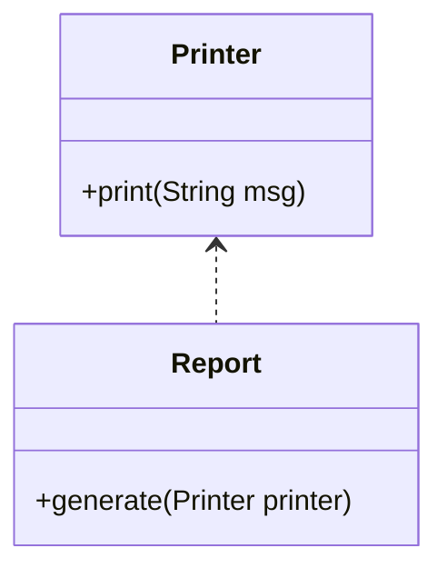
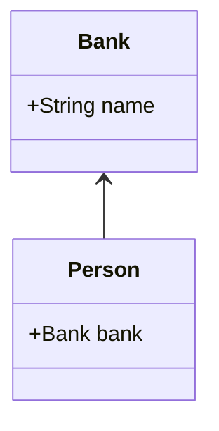
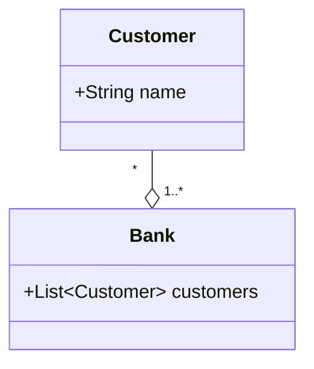
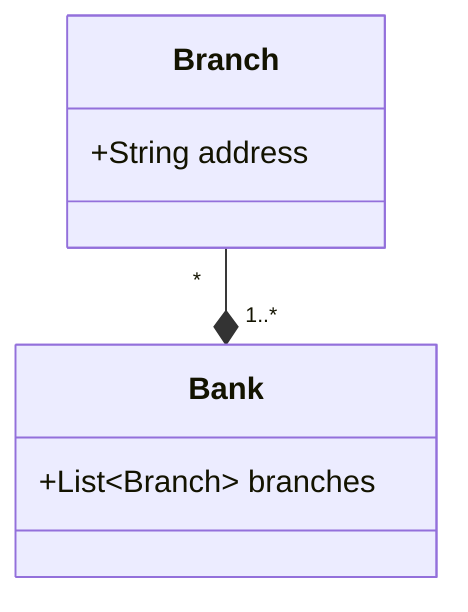

# Dependency (as defined in *OOP in 21 Days*)

## Definition

**Dependency** is the simplest relationship between objects.

> One object depends on another object’s **specification** (that is, its **interface or behavior**).

This means:

- One object **uses** another
- But does **not own** it
- And does **not control its lifetime**

If the used object’s specification changes, the dependent object must change too.

---

## Simple Example of Dependency

```java
class Printer {
    void print(String msg) {
        System.out.println(msg);
    }
}
```

```java
class Report {
    void generate(Printer printer) {
        printer.print("Report generated");
    }
}
```

---

## What Is Happening?

- `Report` depends on `Printer`
- `Printer` is passed in as a parameter
- `Report` uses `Printer`’s behavior
- `Report` does not store the `Printer`

This is a **dependency relationship**.

---

## Why This Is a Dependency (Book Definition)

- The relationship is **temporary**
- It exists only during method execution
- `Report` relies on the **specification** of `Printer`
- If `Printer.print()` changes, `Report` must be updated

---

## Dependency vs Stronger Relationships

The book emphasizes that dependency is **weak**:

| Relationship | Strength |
|-------------|----------|
| Dependency | Weak |
| Association | Stronger |
| Aggregation / Composition | Strongest |

Dependency means:

> “I use you”

Not:

> “I have you”

---

## Dependency + Polymorphism (Important Tie‑In)

Dependency becomes more flexible when you depend on an **interface** instead of a concrete class.

```java
interface Logger {
    void log(String msg);
}
```

```java
class FileLogger implements Logger {
    public void log(String msg) { }
}
```

```java
class Service {
    void execute(Logger logger) {
        logger.log("Service executed");
    }
}
```

### What This Achieves

- `Service` depends on the **Logger specification**
- Not on a specific implementation
- Polymorphism determines which logger is used

This is **good OO design** per *OOP in 21 Days*.

---

## Key Warning from the Definition

> If the specification changes, you must update the dependent object.

This is unavoidable:

- Dependency creates coupling
- The goal is to depend on **stable specifications**

---

## Final Takeaway (Exam‑Ready)

> Dependency is a relationship in which one object relies on another object’s specification to perform its work. If that specification changes, the dependent object must also change.

## How Association classified?

- Association → the general relationship
- Aggregation → a refined association (whole/part, peers) peer means the same level importance
- Composition → a refined association (whole/part, dependent)

> Aggregation and composition are types of association But association can exist by itself

## 1️⃣ Dependency — “I use you” (temporary)

- Uses another object’s specification
- Exists only during method execution
- No structural connection

```java
class Printer {
    void print(String msg) {
        System.out.println(msg);
    }
}
```

```java
class Report {
    void generate(Printer printer) {
        printer.print("Report generated");
    }
}
```




### Why this is Dependency?

- Printer is passed as a parameter
- Report does not store it
- Relationship ends when generate() ends

📌 Conceptual rule

> Temporary usage → Dependency

## 2️⃣ Association — “I am connected to you”
- Structural relationship
- Objects are connected
- No ownership or existence dependency
- Models roles

```java
class Person {
    Bank bank;
}
```

```java
class Bank {
    String name;
}

```



### Why this is Association?

- Person has a reference to Bank
- Person plays the role of borrower
- Bank plays the role of lender
- Either can exist independently

📌 Conceptual rule

> Structural connection without ownership → Association

## 3️⃣ ️Aggregation — “I have you, but you are independent”

- Special kind of association
- Whole/part relationship among peers
- Part can exist without the whole

Example
```java
class Customer {
    String name;
}
```

```java
class Bank {
    List<Customer> customers = new ArrayList<>();
}
```



### Why this is Aggregation?

- Bank has Customers
- Customers exist without the Bank
- Bank exists without a specific Customer
- Peer relationship

📌 Conceptual rule

> Whole/part + independent existence → Aggregation

## 4️⃣ Composition — “I own you” (existence dependency)

- Strongest relationship
- Part cannot exist without the whole
- Not a peer relationship

Example
```java
class Branch {
    String address;
    
    Branch(String address) {
        this.address = address;
    }
}
```

```java
class Bank {
    List<Branch> branches = new ArrayList<>();

    Bank() {
        branches.add(new Branch("Main Street"));
    }
}
```



### Why this is Composition?

- Branch exists only as part of Bank
- No meaningful Branch without Bank
- If Bank goes away, Branches go away conceptually

📌 Conceptual rule

> Whole/part + existence dependency → Composition

**Dependency:** uses

**Association:** connects

**Aggregation:** groups peers

**Composition:** owns parts

**Generalization:** is a